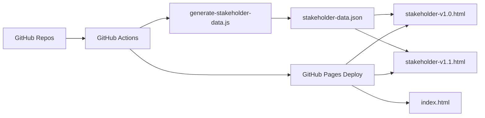

# Playwatch Dashboards


Leadership-facing quality dashboards powered by GitHub Pages, Playwright, and GitHub Actions.

## Architecture



## Live Views

| View | Purpose | URL |
|---|---|---|
| QA dashboard | Main internal dashboard | [Open](https://ghaidaahh.github.io/playwright-opencodegen/) |
| Stakeholder v1.0 | Current stakeholder version | [Open](https://ghaidaahh.github.io/playwright-opencodegen/stakeholder-v1.0.html) |
| Stakeholder v1.1 | Prototype for review | [Open](https://ghaidaahh.github.io/playwright-opencodegen/stakeholder-v1.1.html) |

## Project Snapshot

This repository now keeps only the active dashboard flow:

- [index.html](/Users/ghegazy/Playwright/index.html): main QA dashboard
- [stakeholder-v1.0.html](/Users/ghegazy/Playwright/stakeholder-v1.0.html): current stakeholder dashboard
- [stakeholder-v1.1.html](/Users/ghegazy/Playwright/stakeholder-v1.1.html): prototype stakeholder dashboard
- [stakeholder-data.json](/Users/ghegazy/Playwright/stakeholder-data.json): generated data source for stakeholder views
- [scripts/generate-stakeholder-data.js](/Users/ghegazy/Playwright/scripts/generate-stakeholder-data.js): GitHub data generator
- [tests/stakeholder-dashboard.spec.ts](/Users/ghegazy/Playwright/tests/stakeholder-dashboard.spec.ts): stakeholder dashboard validation suite
- [.github/workflows/deploy.yml](/Users/ghegazy/Playwright/.github/workflows/deploy.yml): dashboard deploy workflow
- [.github/workflows/playwright.yml](/Users/ghegazy/Playwright/.github/workflows/playwright.yml): Playwright test workflow
- [architecture-options.md](/Users/ghegazy/Playwright/architecture-options.md): S3 vs Supabase comparison

## How It Works

```text
GitHub Actions
    -> collect runs, PRs, releases, and test inventory
    -> generate stakeholder-data.json
    -> deploy to GitHub Pages
    -> stakeholder dashboards read the generated JSON in the browser
```

## Automated Today

- Workflow run collection from GitHub
- Latest merged PR collection
- Latest release fallback
- Test inventory discovery from repo test files
- Coverage counts by test tags where available
- Configurable business thresholds through GitHub variables

## Versions

| Version | Status | Notes |
|---|---|---|
| [stakeholder-v1.0.html](/Users/ghegazy/Playwright/stakeholder-v1.0.html) | Stable | Current stakeholder version |
| [stakeholder-v1.1.html](/Users/ghegazy/Playwright/stakeholder-v1.1.html) | Prototype | Review artifact for layout, trust signals, and readability |

## Local Run

Install:

```bash
npm ci
npx playwright install --with-deps
```

Serve locally:

```bash
python3 -m http.server 3000
```

Open locally:

- `http://127.0.0.1:3000/index.html`
- `http://127.0.0.1:3000/stakeholder-v1.0.html`
- `http://127.0.0.1:3000/stakeholder-v1.1.html`

## Test Commands

Normal stakeholder run:

```bash
npx playwright test tests/stakeholder-dashboard.spec.ts --project=chromium
```

Intentional failing run:

```bash
SIMULATE_FAILING_DASHBOARD_TEST=true npx playwright test tests/stakeholder-dashboard.spec.ts --project=chromium
```

## GitHub Actions Setup

**Required secret**

- `GH_DASHBOARD_TOKEN`

Recommended permissions:

- `Actions: Read`
- `Contents: Read`
- `Metadata: Read`
- `Pull requests: Read`

**Required variable**

- `STAKEHOLDER_REPOS`

Example:

```text
Ghaidaahh/playwright-opencodegen,owner/repo-two,owner/repo-three
```

**Optional variables**

- `STAKEHOLDER_WORKFLOW_FILE`
- `STAKEHOLDER_WORKFLOW_FILES`
- `STAKEHOLDER_WORKFLOW_MAP`
- `STAKEHOLDER_DAYS_BACK`
- `STAKEHOLDER_RISK_FAILED_RUNS`
- `STAKEHOLDER_RISK_PASS_RATE`
- `STAKEHOLDER_ATTENTION_PASS_RATE`
- `STAKEHOLDER_BUILD_RISK_FAILED_RUNS`

## Important Note

The stakeholder password in:

- [stakeholder-v1.0.html](/Users/ghegazy/Playwright/stakeholder-v1.0.html)
- [stakeholder-v1.1.html](/Users/ghegazy/Playwright/stakeholder-v1.1.html)

is still client-side because the site is static. A real secure login would require a backend.

## Current Direction

- keep `v1.0` as the stable stakeholder version
- use `v1.1` for lead review and design exploration
- keep generation automated in GitHub Actions
- decide later whether long-term data storage should move to S3 or Supabase
