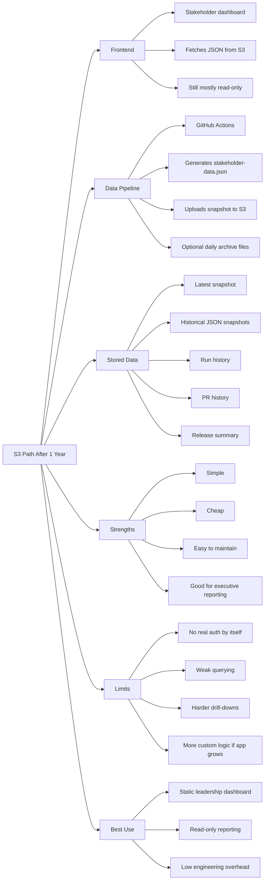
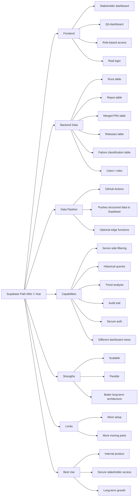

# Architecture Options

## S3 Path After 1 Year

```mermaid
flowchart LR

    A["S3 Path After 1 Year"]

    A --> A1["Frontend"]
    A1 --> A11["Stakeholder dashboard"]
    A1 --> A12["Fetches JSON from S3"]
    A1 --> A13["Still mostly read-only"]

    A --> A2["Data Pipeline"]
    A2 --> A21["GitHub Actions"]
    A2 --> A22["Generates stakeholder-data.json"]
    A2 --> A23["Uploads snapshot to S3"]
    A2 --> A24["Optional daily archive files"]

    A --> A3["Stored Data"]
    A3 --> A31["Latest snapshot"]
    A3 --> A32["Historical JSON snapshots"]
    A3 --> A33["Run history"]
    A3 --> A34["PR history"]
    A3 --> A35["Release summary"]

    A --> A4["Strengths"]
    A4 --> A41["Simple"]
    A4 --> A42["Cheap"]
    A4 --> A43["Easy to maintain"]
    A4 --> A44["Good for executive reporting"]

    A --> A5["Limits"]
    A5 --> A51["No real auth by itself"]
    A5 --> A52["Weak querying"]
    A5 --> A53["Harder drill-downs"]
    A5 --> A54["More custom logic if app grows"]

    A --> A6["Best Use"]
    A6 --> A61["Static leadership dashboard"]
    A6 --> A62["Read-only reporting"]
    A6 --> A63["Low engineering overhead"]
```

## Supabase Path After 1 Year

```mermaid
flowchart LR

    B["Supabase Path After 1 Year"]

    B --> B1["Frontend"]
    B1 --> B11["Stakeholder dashboard"]
    B1 --> B12["QA dashboard"]
    B1 --> B13["Role-based access"]
    B1 --> B14["Real login"]

    B --> B2["Backend Data"]
    B2 --> B21["Runs table"]
    B2 --> B22["Repos table"]
    B2 --> B23["Merged PRs table"]
    B2 --> B24["Releases table"]
    B2 --> B25["Failure classification table"]
    B2 --> B26["Users / roles"]

    B --> B3["Data Pipeline"]
    B3 --> B31["GitHub Actions"]
    B3 --> B32["Pushes structured data to Supabase"]
    B3 --> B33["Optional edge functions"]

    B --> B4["Capabilities"]
    B4 --> B41["Server-side filtering"]
    B4 --> B42["Historical queries"]
    B4 --> B43["Trend analysis"]
    B4 --> B44["Audit trail"]
    B4 --> B45["Secure auth"]
    B4 --> B46["Different dashboard views"]

    B --> B5["Strengths"]
    B5 --> B51["Scalable"]
    B5 --> B52["Flexible"]
    B5 --> B53["Better long-term architecture"]

    B --> B6["Limits"]
    B6 --> B61["More setup"]
    B6 --> B62["More moving parts"]

    B --> B7["Best Use"]
    B7 --> B71["Internal product"]
    B7 --> B72["Secure stakeholder access"]
    B7 --> B73["Long-term growth"]
```
